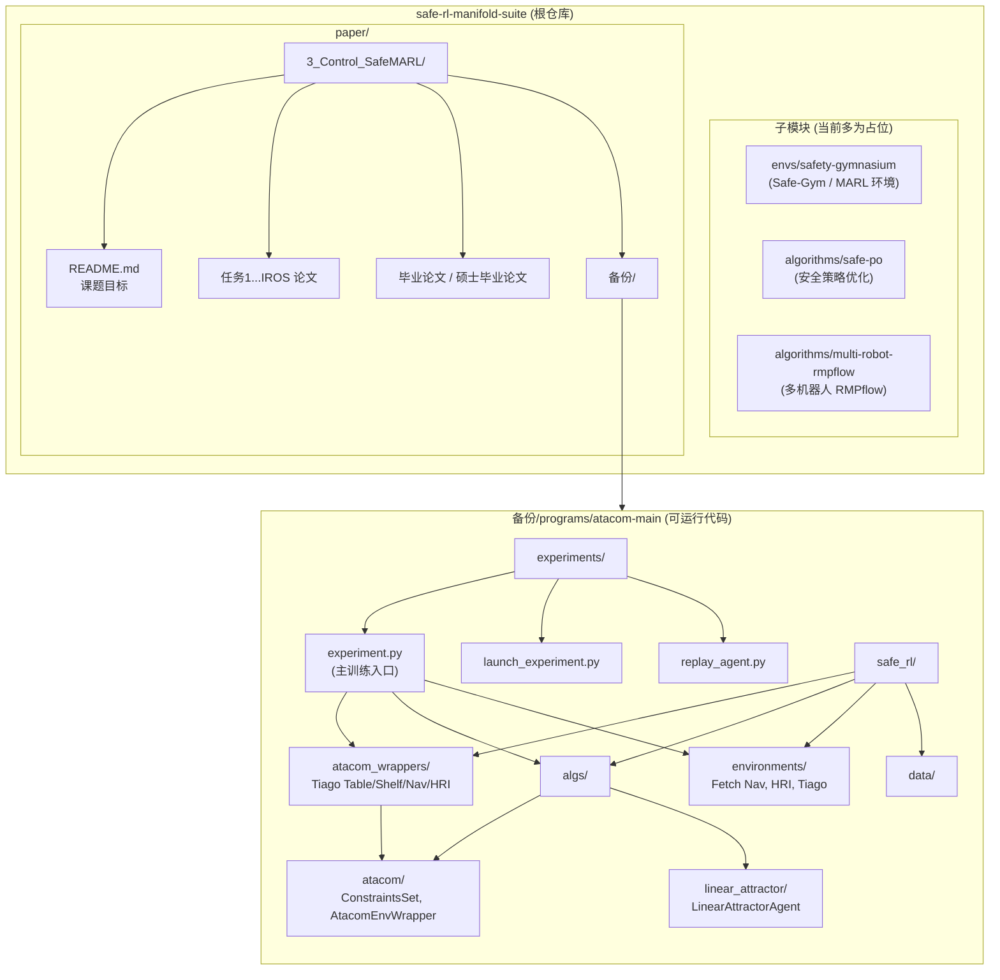
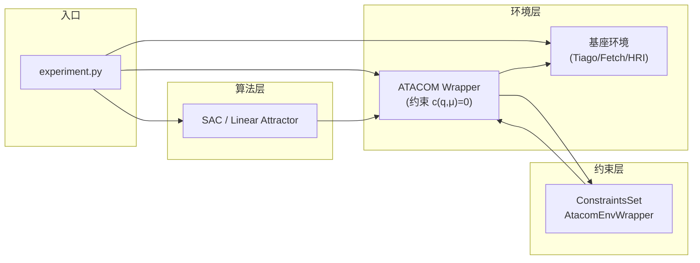

# safe-rl-manifold-suite 程序架构说明

## 一、仓库根目录与子模块

| 路径 | 功能说明 | 当前状态 |
|------|----------|----------|
| **根目录** | 安全强化学习 + 黎曼流形约束的统一套件，整合环境、算法与论文代码 | 主仓库 |
| **envs/safety-gymnasium** | Safe-Gym / OmniSafe 风格的安全 MARL 仿真环境（子模块 chengzizhuo/safe-gym） | 子模块占位，目录为空 |
| **algorithms/safe-po** | 安全策略优化算法库（子模块） | 子模块占位，目录为空 |
| **algorithms/multi-robot-rmpflow** | 多机器人 RMPflow 运动规划/约束控制（子模块） | 子模块占位，目录为空 |
| **paper/safe-rl-manifold-constraints** | 黎曼流形约束相关论文/代码（子模块） | 已在 git 中删除 (D) |

---

## 二、paper/ 目录

| 路径 | 功能说明 |
|------|----------|
| **paper/3_Control_SafeMARL/** | 毕设/课题「控制与 SafeMARL」主目录 |
| **3_Control_SafeMARL/README.md** | 课题目标：黎曼流形下的安全动作决策、SafeMARL 环境与算法库、导航场景 safeRL/safeMARL、ROS2 约束因子图等 |
| **3_Control_SafeMARL/任务1-MICL-2023-ConstrainedMARL-ConstrainedfactorSLAM/** | IROS 等会议论文（约束 MARL、约束因子图 SLAM、安全可行域分析等） |
| **3_Control_SafeMARL/毕业论文/** | 本科毕业论文 LaTeX |
| **3_Control_SafeMARL/硕士毕业论文/** | 硕士论文（含 GMAH 分层 MARL、QMIX、目标混合网络等） |
| **3_Control_SafeMARL/备份/** | 备份材料与可运行程序 |

---

## 三、备份中的可运行程序：atacom-main

位置：`paper/3_Control_SafeMARL/备份/programs/atacom-main/`

基于 **ATACOM**（约束流形上的安全 RL）和 **Mushroom-RL**，实现机械臂/移动机器人导航、操作与人机交互的安全控制。

### 3.1 顶层结构

| 路径 | 功能 |
|------|------|
| **experiments/** | 实验入口与启动脚本 |
| **safe_rl/** | 安全 RL 核心库（环境、ATACOM 封装、算法、数据） |

### 3.2 experiments/

| 文件 | 功能 |
|------|------|
| **experiment.py** | 主训练入口：构建 MDP、ATACOM 封装、SAC/Linear Attractor 等 agent，Core 学习与评估循环 |
| **launch_experiment.py** | 批量/参数化启动实验 |
| **replay_agent.py** | 加载已训练 agent 进行回放/评估 |

### 3.3 safe_rl/

| 子包/模块 | 功能 |
|-----------|------|
| **atacom_wrappers/** | 对基座环境的 ATACOM 约束封装，将动作空间映射到约束流形（零空间控制） |
| **algs/atacom/** | ATACOM 核心：约束集 `ConstraintsSet`、`StateConstraint`、`AtacomEnvWrapper`（slack 型约束、dq→控制动作） |
| **algs/linear_attractor/** | 线性吸引子策略与 Agent，用于无需训练的基线/演示 |
| **environments/** | 基座仿真环境：Fetch 导航、Tiago 桌面/货架/导航、HRI（人机交互，SMPL-X 人体） |
| **data/** | 数据路径（如 SMPL 模型目录） |

### 3.4 环境与算法对应关系

- **环境名**：`table`, `shelf`, `nav`, `hri` 及对应 `*_atacom`、`*_se` 变体。
- **算法**：`sac`（Mushroom-RL SAC）、`la`（Linear Attractor）；ATACOM 通过 `*_atacom` 环境封装接入。

---

## 四、程序架构图（Mermaid）



---

## 五、数据流与调用关系简图



---

## 六、小结

- **根仓库**：通过子模块规划了「环境 (safety-gymnasium) + 算法 (safe-po, multi-robot-rmpflow)」的 Safe RL + 黎曼流形套件，当前这些子模块目录为空。
- **实际可运行代码**：集中在 `paper/3_Control_SafeMARL/备份/programs/atacom-main`，实现基于 ATACOM 的约束流形安全 RL（SAC + 各类 Tiago/Fetch/HRI 环境）。
- **论文与课题**：`paper/3_Control_SafeMARL` 下包含课题说明、IROS 论文、本硕论文及备份，与 atacom-main 共同构成「控制 + SafeMARL」的文档与实现架构。

---

## 七、框架重构方案

为了更方便地扩展环境和 MARL 算法，建议采用以下架构重构方案。

### 7.1 当前架构问题

| 问题 | 影响 |
|------|------|
| 环境/算法/安全模块耦合 | 添加新组件需要修改多处 |
| 配置分散 | 难以统一管理实验参数 |
| 无注册机制 | 不能动态选择组件 |
| 训练逻辑硬编码 | 难以复用和扩展 |

### 7.2 推荐框架

| 框架 | 用途 | 优势 |
|------|------|------|
| **Hydra** | 配置管理 | 灵活组合、支持 sweep |
| **WandB** | 实验追踪 | 可视化、协作 |
| **Gymnasium** | 环境接口 | 标准化、社区支持 |
| **Registry Pattern** | 组件注册 | 动态选择、可扩展 |

### 7.3 核心设计：Registry Pattern

```python
# cosmos/registry.py
class Registry:
    """通用组件注册器"""

    def __init__(self, name: str):
        self.name = name
        self._registry = {}

    def register(self, name: str = None):
        """装饰器注册组件"""
        def decorator(cls):
            key = name or cls.__name__
            self._registry[key] = cls
            return cls
        return decorator

    def build(self, name: str, **kwargs):
        """根据名称构建组件"""
        return self._registry[name](**kwargs)

# 全局注册器
ENV_REGISTRY = Registry("environment")
ALGO_REGISTRY = Registry("algorithm")
SAFETY_REGISTRY = Registry("safety_filter")
```

### 7.4 环境基类

```python
# cosmos/envs/base.py
from abc import ABC, abstractmethod
import gymnasium as gym

class BaseMultiAgentEnv(gym.Env, ABC):
    """多智能体环境基类"""

    @property
    @abstractmethod
    def num_agents(self) -> int:
        pass

    @property
    @abstractmethod
    def observation_space(self) -> gym.Space:
        pass

    @property
    @abstractmethod
    def share_observation_space(self) -> gym.Space:
        """CTDE 共享观测空间"""
        pass

    @abstractmethod
    def get_constraint_info(self) -> dict:
        """返回安全约束所需信息"""
        pass


# 注册环境
@ENV_REGISTRY.register("formation_nav")
class FormationNavEnv(BaseMultiAgentEnv):
    pass

@ENV_REGISTRY.register("mpe")
class MPEEnv(BaseMultiAgentEnv):
    pass
```

### 7.5 算法基类

```python
# cosmos/algos/base.py
from abc import ABC, abstractmethod

class BaseMARLAlgo(ABC):
    """MARL 算法基类"""

    @abstractmethod
    def get_actions(self, obs, deterministic=False):
        pass

    @abstractmethod
    def update(self, buffer) -> dict:
        pass

    @abstractmethod
    def save(self, path: str):
        pass

    @abstractmethod
    def load(self, path: str):
        pass


# 注册算法
@ALGO_REGISTRY.register("mappo")
class MAPPO(BaseMARLAlgo):
    pass

@ALGO_REGISTRY.register("qmix")
class QMIX(BaseMARLAlgo):
    pass

@ALGO_REGISTRY.register("maddpg")
class MADDPG(BaseMARLAlgo):
    pass
```

### 7.6 安全滤波器基类

```python
# cosmos/safety/base.py
from abc import ABC, abstractmethod

class BaseSafetyFilter(ABC):
    """安全滤波器基类"""

    @abstractmethod
    def reset(self, constraint_info: dict):
        pass

    @abstractmethod
    def project(self, actions, constraint_info, dt) -> np.ndarray:
        """投影动作到安全空间"""
        pass


# 注册安全滤波器
@SAFETY_REGISTRY.register("cosmos")
class COSMOS(BaseSafetyFilter):
    pass

@SAFETY_REGISTRY.register("cbf")
class CBFFilter(BaseSafetyFilter):
    pass

@SAFETY_REGISTRY.register("none")
class NoFilter(BaseSafetyFilter):
    def project(self, actions, *args, **kwargs):
        return actions  # 直接返回原始动作
```

### 7.7 Hydra 配置示例

```yaml
# configs/config.yaml
defaults:
  - env: formation_nav
  - algo: mappo
  - safety: cosmos

experiment:
  name: cosmos_exp
  seed: 42
  num_episodes: 200
  device: auto

wandb:
  enabled: true
  project: cosmos-marl
```

```yaml
# configs/env/formation_nav.yaml
name: formation_nav
num_agents: 4
formation: square
arena_size: 5.0
num_obstacles: 4
```

```yaml
# configs/algo/mappo.yaml
name: mappo
actor_lr: 3e-4
critic_lr: 3e-4
ppo_epochs: 10
clip_param: 0.2
```

### 7.8 统一训练入口

```python
# cosmos/train.py
import hydra
from omegaconf import DictConfig

@hydra.main(config_path="configs", config_name="config")
def main(cfg: DictConfig):
    # 从注册表构建组件
    env = ENV_REGISTRY.build(cfg.env.name, cfg=cfg.env)
    algo = ALGO_REGISTRY.build(cfg.algo.name, ...)
    safety = SAFETY_REGISTRY.build(cfg.safety.name, ...)

    trainer = Trainer(env, algo, safety, cfg)
    trainer.train()

if __name__ == "__main__":
    main()
```

### 7.9 使用示例

```bash
# 基础训练
python -m cosmos.train

# 切换算法
python -m cosmos.train algo=qmix

# 切换环境
python -m cosmos.train env=mpe

# 覆盖参数
python -m cosmos.train env.num_agents=6 algo.lr=1e-4

# 多配置 sweep
python -m cosmos.train -m algo=mappo,qmix,maddpg
```

### 7.10 新目录结构

```
cosmos/
├── __init__.py
├── registry.py              # 组件注册器
├── trainer.py               # 统一训练器
├── configs/                 # Hydra 配置
│   ├── config.yaml
│   ├── env/
│   │   ├── formation_nav.yaml
│   │   ├── mpe.yaml
│   │   └── traffic.yaml
│   ├── algo/
│   │   ├── mappo.yaml
│   │   ├── qmix.yaml
│   │   └── maddpg.yaml
│   └── safety/
│       ├── cosmos.yaml
│       ├── cbf.yaml
│       └── none.yaml
├── envs/                    # 环境
│   ├── __init__.py
│   ├── base.py
│   ├── formation_nav/
│   └── mpe/
├── algos/                   # MARL 算法
│   ├── __init__.py
│   ├── base.py
│   ├── mappo/
│   ├── qmix/
│   └── maddpg/
├── safety/                  # 安全滤波器
│   ├── __init__.py
│   ├── base.py
│   ├── cosmos/
│   └── cbf/
└── utils/
    ├── logger.py
    ├── checkpoint.py
    └── visualization.py
```

### 7.11 添加新组件

#### 添加新环境

```python
# cosmos/envs/traffic.py
@ENV_REGISTRY.register("traffic")
class TrafficEnv(BaseMultiAgentEnv):
    """多车交通环境"""
    pass
```

```yaml
# configs/env/traffic.yaml
name: traffic
num_vehicles: 10
road_length: 100
```

#### 添加新算法

```python
# cosmos/algos/happo.py
@ALGO_REGISTRY.register("happo")
class HAPPO(BaseMARLAlgo):
    """Heterogeneous-Agent PPO"""
    pass
```

### 7.12 迁移路径

| 阶段 | 任务 | 风险 |
|------|------|------|
| Phase 1 | 添加 Registry，不改变现有代码 | 低 |
| Phase 2 | 定义基类接口，现有类继承 | 低 |
| Phase 3 | 添加 Hydra 配置 | 中 |
| Phase 4 | 重构 Trainer | 中 |
| Phase 5 | 添加新环境/算法 | 低 |

### 7.13 参考框架

| 框架 | GitHub | 说明 |
|------|--------|------|
| **EPyMARL** | uoe-agents/epymarl | 多算法 MARL 框架 |
| **MARLLIB** | Replicable-MARL/MARLlib | 统一 MARL 库 |
| **CleanRL** | vwxyzjn/cleanrl | 单文件 RL 实现 |
| **TorchRL** | pytorch/rl | PyTorch 官方 RL |
| **OmniSafe** | PKU-Alignment/omnisafe | 安全 RL 框架 |
